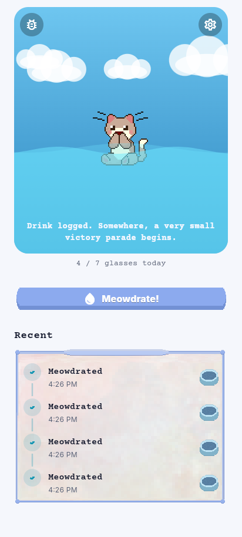
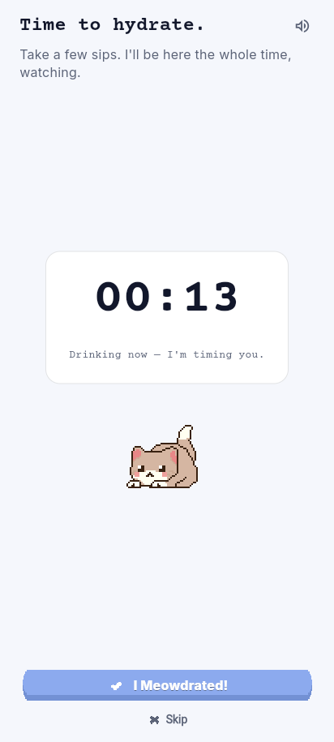
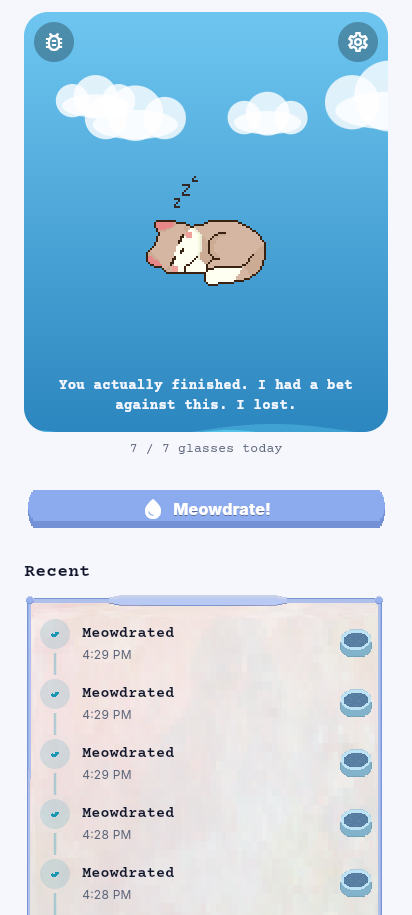
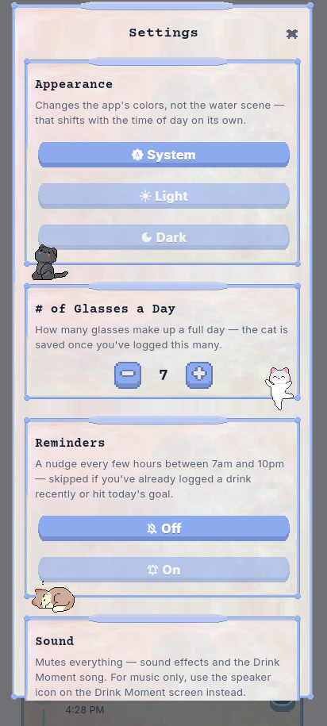

# Meowdrate

A hydration app that starts full instead of empty. No points to grind,
no shop, no ads, no accounts - just a flood that recedes as you drink,
a cat to rescue, and a sarcastic narrator who has opinions
about your hydration habits.

## What it is

The screen is a flood scene: water swishing near the top, sky shifting
with the real time of day. Each drink you log recedes the flood a
little, slowly saving the cat from the water. Clear it fully and the cat says thanks;
leave it unfinished and the narrator will have a comment about that too. Nothing is ever actually lost. No streak-shaming, no locked
content, no per-day history to grieve if you miss a day or lose the
phone. There's a day-count, but it's tucked away in Settings rather than
sitting on the home screen. The goal is better habits, not a number
pulling you back to check in.

Everything is stored locally - no backend, no login. This is intentional.

## Screenshots

<p align="center">
  
  
  
  
</p>

## Tech stack

- Flutter (Dart)
- Riverpod (`flutter_riverpod`) for state management
- `shared_preferences` for local persistence
- `audioplayers` for self-made sound effects (optional — the app runs
  silently until files are dropped in, see `assets/audio/README.md`)
- `flutter_local_notifications` + `timezone`/`flutter_timezone` for
  scheduled hydration reminders
- `home_widget` for the optional Android home-screen widget
- `url_launcher` for the credits/support links in Settings

## How to run

### Prerequisites

- Flutter SDK (`brew install --cask flutter`)
- Chrome (web), or Xcode/Android Studio for simulators/devices

### Install

```bash
flutter pub get
```

### Run

```bash
flutter run -d chrome   # easiest — no simulator/emulator required
flutter run              # picks any connected device/simulator
```

Useful commands:

```bash
flutter analyze
flutter test
```

## Design principles

- Clear boundaries: UI vs. state/providers vs. data/repositories
- Small, focused modules per feature (hydration / flood / creatures /
  narrator / settings / reminders / debug)
- Local-first persistence, no backend dependency — and deliberately
  shallow: no per-day history is kept, so there's nothing to lose
- Two independent theming axes: the flood scene's automatic day/night
  sky (device clock) and the user's manual Light/Dark/System chrome
  preference never affect each other
- Consistent styling via theme tokens
